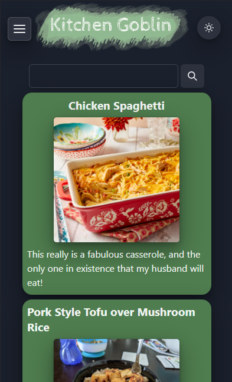

# Kitchen Goblin

Kitchen Goblin is a recipe book platform that allows for iterative recipe storage.

Each recipe a user stores is capable of storing variations as "Cooks" that may contain differing ingredient lists, directions and miscellaneous notes.

Recipes may also be listed publically or privately. Publically listed recipes will display for all users, logged in or not where as privately listed recipes are only visible to the owning user.

## License

[MIT](https://choosealicense.com/licenses/mit/)

## Authors

- [@charlestietjen](https://www.github.com/charlestietjen)

## Live Deploy

[Available Here](https://kitchen-goblin.herokuapp.com/)
## Screenshots

